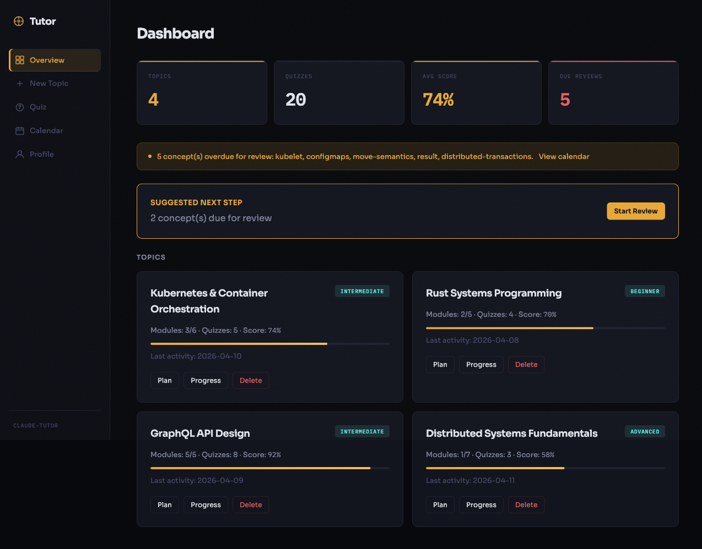
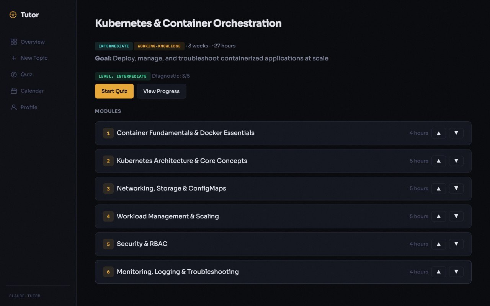
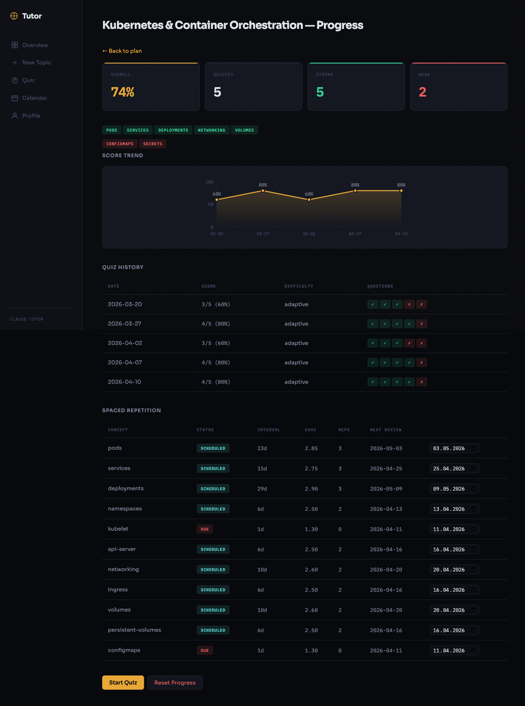
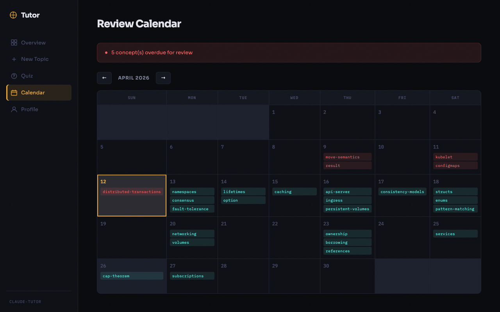

<p align="center">
  
</p>
<h1 align="center">claude-tutor</h1>
<p align="center">Turn Claude Code into your personal tutor — with spaced repetition.</p>

<p align="center">
  <a href="LICENSE"></a>
  <a href="https://github.com/kirilxd/claude-tutor"></a>
  <a href="https://github.com/kirilxd/claude-tutor"></a>
</p>

<br>

<p align="center">
  
</p>

<br>

## Get started in 10 seconds

```
/plugin marketplace add kirilxd/claude-tutor
/plugin install claude-tutor@kirilxd-plugins
```

Then just say:

```
teach me about Kubernetes
```

---

## What it does

Claude Tutor creates personalized learning plans, quizzes you with adaptive difficulty, and schedules reviews using SM-2 spaced repetition — all inside Claude Code. Works with any topic: programming, system design, DevOps, languages, science, history, music theory.

**No slash commands needed.** Just talk naturally:

| Say this | Claude does this |
|---|---|
| "teach me about recursion" | Creates a learning plan with curated resources |
| "quiz me on networking" | Adaptive quiz targeting your weak areas |
| "how well do I know Python" | Progress report with study recommendations |
| "find me resources on Rust" | Curated materials grouped by module |
| "open dashboard" | Launches web UI at localhost:3847 |

## The learning cycle

```
plan → study → quiz → review → repeat
```

1. **Plan** — `/learn` researches your topic and builds a structured plan with modules, concepts, and curated resources
2. **Study** — Claude teaches each module interactively with analogies, examples, and comprehension checks
3. **Quiz** — `/quiz` tests you with mixed formats (MCQ, true/false, short answer, fill-in-blank) that adapt to your level
4. **Review** — SM-2 spaced repetition schedules concept reviews at optimal intervals (1d → 6d → 15d → ...)
5. **Repeat** — `/review` shows progress and recommends what to study next

## Key features

| | Feature | Details |
|---|---|---|
| 🧠 | **SM-2 spaced repetition** | Industry-standard algorithm schedules reviews right before you forget |
| 📊 | **Adaptive difficulty** | Questions get harder as you improve, easier when you struggle |
| 🎯 | **Weak area targeting** | Quizzes prioritize concepts you've gotten wrong before |
| 👤 | **Learner profiles** | Remembers your style (hands-on, visual, theory-first) across all topics |
| 🔍 | **Diagnostic assessment** | Calibrates your actual level so you skip what you already know |
| 🔔 | **Session-start reminders** | Shows overdue reviews every time you open Claude Code |
| 🛡️ | **Schema enforcement** | PreToolUse hooks prevent data corruption automatically |
| 🌐 | **Web dashboard** | Full visual interface — create plans, take quizzes, view calendar |

## Web dashboard

A local web UI at `http://localhost:3847` with everything you need:

| View | What it does |
|---|---|
| **Overview** | All topics, stats, overdue alerts, study recommendations |
| **Create Topic** | Build a learning plan via form — Claude researches and generates it |
| **Take Quiz** | Interactive MCQ/True-False quiz with instant feedback |
| **Plan Viewer** | Browse modules, reorder them, view resources |
| **Progress** | Score trend chart, quiz history, spaced repetition schedule |
| **Calendar** | Monthly view of upcoming and overdue reviews |
| **Profile** | Edit learning style and background preferences |

The dashboard and CLI share the same data. Switch between them freely.

<details>
<summary>Learning plan</summary>
<br>

</details>

<details>
<summary>Progress tracking</summary>
<br>

</details>

<details>
<summary>Review calendar</summary>
<br>

</details>

## Commands

| Command | Description | Example |
|---|---|---|
| `/learn <topic>` | Create a learning plan with web research | `/learn Kubernetes` |
| `/quiz [topic]` | Take an adaptive quiz | `/quiz` or `/quiz DNS` |
| `/review [topic]` | View progress and recommendations | `/review` |
| `/resources <topic>` | Get curated learning resources | `/resources system design` |
| `/dashboard` | Launch the web dashboard | `/dashboard` |

## Your data stays local

All data is stored on your machine. Nothing is sent to external services.

```
~/.claude/learning/
├── index.json              # topic registry
├── profile.json            # learner preferences
├── plans/
│   └── <topic>-<date>.json # learning plans
└── progress/
    └── <topic>.json        # quiz results, spaced repetition schedules
```

## Development

```
claude-tutor/
├── .claude-plugin/
│   ├── plugin.json         # plugin manifest
│   └── marketplace.json    # marketplace definition
├── commands/               # slash command definitions
├── skills/                 # skill instructions (SKILL.md files)
│   ├── learn/
│   ├── quiz/
│   ├── review/
│   ├── resources/
│   └── dashboard/server/   # Express server + vanilla JS frontend
├── hooks/                  # PreToolUse + SessionStart hooks
├── tests/                  # hook unit tests
└── evals/                  # trigger + functional evaluations
```

### Running tests

```bash
node tests/test-hooks.js                              # hook unit tests (27 tests)
./evals/run-trigger-eval.sh                           # trigger evals (17 prompts)
./evals/run-functional-eval.sh                        # end-to-end evals (21 checks)
node skills/dashboard/server/tests/dashboard.test.js  # dashboard tests (30 scenarios)
```

## Known limitations

| Limitation | Details |
|---|---|
| **Quiz formats** | Dashboard supports MCQ and True/False only. Short answer and fill-in-blank are CLI-only. |
| **AskUserQuestion** | CLI may fall back to plain text depending on Claude Code version. |
| **CLI schema drift** | Claude occasionally invents field names. Dashboard normalizes on read; hook blocks common errors. |

## Uninstalling

```
/plugin uninstall claude-tutor@kirilxd-plugins
/plugin marketplace remove kirilxd-plugins
```

To remove learning data: `rm -rf ~/.claude/learning/`

## License

MIT
